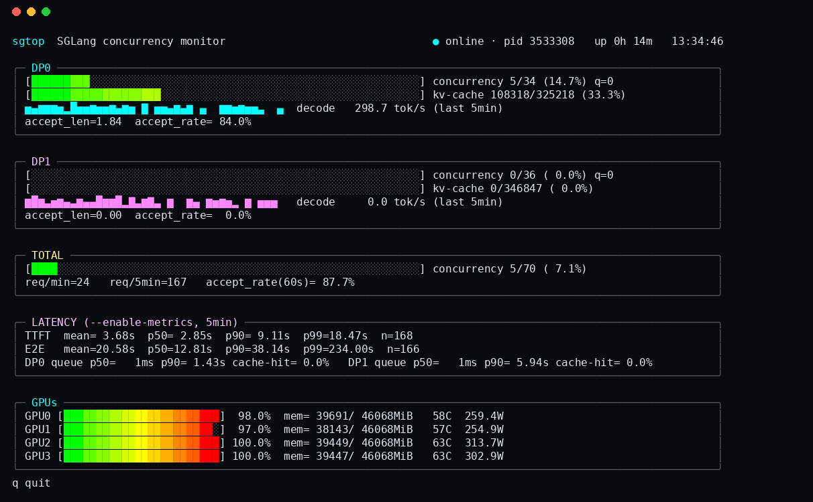

# sgtop

A [btop](https://github.com/aristocratos/btop)-style terminal dashboard for a live [SGLang](https://github.com/sgl-project/sglang) deployment — concurrency, KV-cache headroom, GPU utilization, and (optionally) per-request latency, all in one screen.



Not affiliated with the SGLang project. It's a small, independent, read-only sidecar: it never touches your inference traffic, it only reads sglang's own log file, `nvidia-smi`, and (if enabled) sglang's Prometheus `/metrics` endpoint.

## Why

`nvtop` tells you a GPU is at 98% utilization. It doesn't tell you whether your sglang server can actually take more concurrent requests, whether one data-parallel replica is starving while another is idle, or what your real TTFT looks like. `sgtop` answers those instead:

- **Concurrency vs. capacity** — running requests / the actual `max_running_requests` sglang computed at startup, not a guess.
- **KV-cache headroom** — tokens in use / total KV budget, per replica.
- **Per-DP-replica breakdown** — if you run `--dp-size > 1`, each replica gets its own panel, so an imbalanced load-balancing setup is obvious at a glance instead of hidden in an aggregate number.
- **Latency percentiles** — TTFT / end-to-end / queue-time p50/p90/p99 over a rolling 5-minute window, once you turn on `--enable-metrics` on the sglang side.
- **GPU panel** — utilization, memory, temperature, power, right below the request-level view.

## Install

```bash
pipx install sgtop        # recommended — isolated, puts `sgtop` on your PATH
# or
pip install --user sgtop
```

Requires Python ≥ 3.9 on Linux or macOS. No dependencies — it's pure standard library (`curses` + `urllib`), so there's nothing else to install.

From source:

```bash
git clone https://github.com/HarrytheOrange/sgtop
cd sgtop
pip install -e .
```

## Quick start

`sgtop` is a client. It needs something to talk to: `sgtop-server`, a small sidecar that tails sglang's log file and exposes a JSON API. Run it on the same machine as sglang (or anywhere with network access to it):

```bash
# 1. Launch sglang, redirecting its output to a file sgtop-server can tail:
python -m sglang.launch_server --model-path ... --dp-size 2 --enable-metrics > server.log 2>&1 &

# 2. Start the sidecar, pointing it at that log file:
sgtop-server --log server.log --service-port 30000 --port 30001 &

# 3. Watch it:
sgtop --port 30001
```

`sgtop-server` also serves a plain HTML version of the same data at `http://<host>:30001/` — handy if you want to glance at it from a browser instead of a terminal, or point it at a machine other than the one you're `ssh`'d into:

```bash
sgtop --host 10.0.0.5 --port 30001
```

## `--enable-metrics` (optional, recommended)

Without it, `sgtop` still shows concurrency, KV-cache usage, throughput and GPU stats — all parsed from sglang's own log lines, no extra flags needed.

Add `--enable-metrics` to your `launch_server` command and the LATENCY panel comes alive with TTFT, end-to-end latency, per-replica queue time, and prefix-cache hit rate, scraped from sglang's Prometheus endpoint. `sgtop-server` diffs consecutive scrapes itself to give you a real rolling-window p50/p90/p99 instead of an all-time average — Prometheus histograms are cumulative counters, so a naive read would just show a number that keeps drifting toward whatever the very first few requests looked like.

## Keybindings

`q` to quit. That's it — it's a dashboard, not an editor.

## How it works

- `sgtop-server` tails the log file sglang writes when you redirect its stdout/stderr, extracting the periodic `Decode batch` / `Prefill batch` lines each DP replica prints, plus the one-time `max_total_num_tokens=... max_running_requests=...` line printed at startup. It samples `nvidia-smi` on an interval, and if `--enable-metrics` is on, scrapes `/metrics` and keeps a short rolling window of histogram deltas for latency percentiles. All of it is exposed as JSON at `/api/status`.
- `sgtop` polls that JSON and renders it with `curses` — gradient meters, sparkline history, boxed panels, degrading gracefully to a 3-color/16-color palette on terminals without 256-color support.

Both are plain Python, no compiled extensions, so `pipx install` is instant.

## License

MIT — see [LICENSE](LICENSE).
